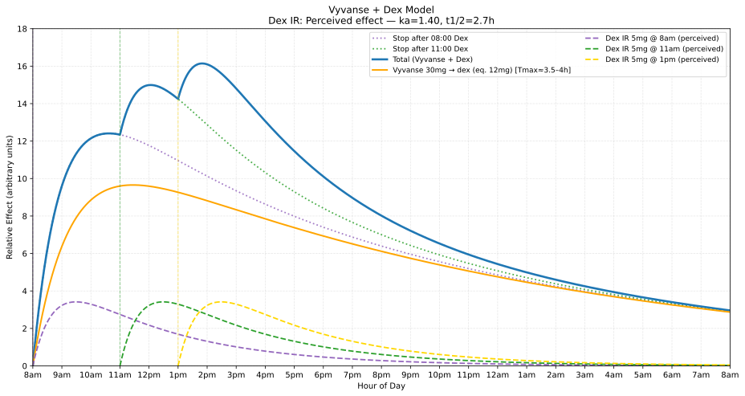
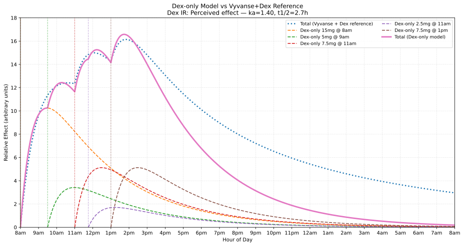
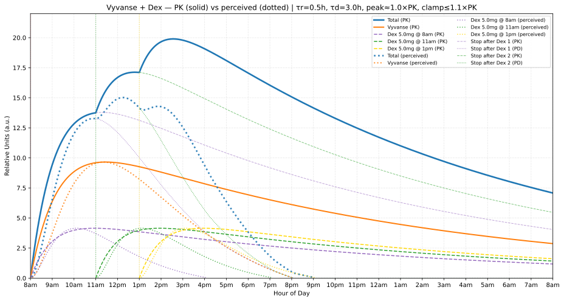

# poc-adhd-dose-optimisation

Proof‑of‑concept (PoC) scripts for exploring ADHD medication dosing patterns and visualising relative effect over time. These models are **intentionally simple** and tuned for quick iteration, **not scientific accuracy.**

> [!IMPORTANT]
> The dose impact and decay models here may not match real pharmacokinetics or perceived effects. Use as exploratory visualisations only — not medical advice.

## Table of Contents

<!-- TOC start (generated with https://bitdowntoc.derlin.ch/) -->
- [What’s Included](#whats-included)
  - [Example Output](#example-output)
- [Notes and Limitations](#notes-and-limitations)
  - [Toggling Dex IR Models (Perceived vs PK)](#toggling-dex-ir-models-perceived-vs-pk)
- [Environment Setup](#environment-setup)
  - [Option A: `pyenv` + `pyenv-virtualenv` (preferred)](#option-a-pyenv--pyenv-virtualenv-preferred)
  - [Option B: Standard virtualenv](#option-b-standard-virtualenv)
- [Running the Scripts](#running-the-scripts)
- [License](#license)
- [See Also](#see-also)
<!-- TOC end -->

## What’s Included

- `graph-vyvanse-with-dex-curves.py`: Models Vyvanse with Dex IR top‑ups (the “reference” scenario) with stop‑after projections.
- `graph-dex-only-curves.py`: Models a Dex IR‑only schedule and compares it against a reference Vyvanse+Dex total.
- `graph-vyvanse-dex-pk-vs-perceived.py`: Compares PK (solid) vs perceived (dotted) using a shaping kernel.

### Example Output

Vyvanse + Dex (reference scenario):



Dex‑only schedule (compared to reference total):



PK vs perceived overlay (kernel‑based perceived effect):



## Notes and Limitations

- Simplified one‑compartment Bateman model; parameters are hand‑tuned for plausible shapes.
- Perceived‑effect modeling differs by script:
  - `graph-vyvanse-with-dex-curves.py` and `graph-dex-only-curves.py`: perceived Dex is approximated by an alternate ka/ke (shorter effective half‑life). You can toggle PK vs perceived in‑file.
  - `graph-vyvanse-dex-pk-vs-perceived.py`: perceived is derived from PK via a shaping kernel (biexponential band‑pass) with peak‑matching and a shorter tail.
- All outputs are in relative units (a.u.) and illustrative — not medical advice.
- Doses and schedules in scripts are examples only.

### Toggling Dex IR Models (Perceived vs PK)

For `graph-vyvanse-with-dex-curves.py` and `graph-dex-only-curves.py`, both include two Dex IR model blocks in the “Pharmacokinetics” section. Toggle by commenting/uncommenting the block you want. The active mode appears in the chart title.

For `graph-vyvanse-dex-pk-vs-perceived.py`, perceived is computed from PK via a kernel and is not toggled via alternate ka/ke.

Actual PK (longer plasma half‑life):

```python
# # Dex IR (actual PK; slower absorption / longer plasma half-life)
# ka_ir          = 1.0               # tuned for Tmax ≈ 2.5–3.5 h
# ke_ir          = np.log(2) / 11.0  # plasma half-life (t½) ≈ 10–12 h
# dex_mode_label = "PK (effective half-life) — ka=1.00, t1/2=11h"
```

Perceived effect (faster onset, shorter felt duration):

```python
# (Optional) Dex IR (perceived effect; faster absorption / shorter effective half-life)
ka_ir          = 1.4               # tuned for Tmax ≈ 1–2 h
ke_ir          = np.log(2) / 2.7   # effective half-life (t½) ≈ 3–4 h
dex_mode_label = "Perceived effect — ka=1.40, t1/2=2.7h"
```

## Environment Setup

You can use either `pyenv` + `pyenv-virtualenv` (preferred) or a standard Python `venv`.

### Option A: `pyenv` + `pyenv-virtualenv` (preferred)

If needed, install via Homebrew on macOS (https://brew.sh/):

```sh
brew update

brew install pyenv pyenv-virtualenv

# Add to your shell profile (zsh shown):
echo 'eval "$(pyenv init -)"' >> ~/.zprofile
echo 'eval "$(pyenv virtualenv-init -)"' >> ~/.zprofile
exec $SHELL -l
```

1) Choose an installed Python version (or install a new one):

```sh
pyenv versions        # list installed
pyenv install -l      # list all available (if you need another)
```

2) Create a project virtualenv and set it locally:

```sh
pyenv virtualenv <python-version> poc-adhd-dose-optimisation
pyenv local poc-adhd-dose-optimisation   # writes .python-version
```

3) Install dependencies:

```sh
python -m pip install -r requirements.txt
```

### Option B: Standard virtualenv

```sh
python3 -m venv .venv
source .venv/bin/activate   # Windows: .venv\Scripts\activate
python -m pip install -r requirements.txt
```

## Running the Scripts

Basic usage:

```sh
python graph-vyvanse-with-dex-curves.py
python graph-dex-only-curves.py
python graph-vyvanse-dex-pk-vs-perceived.py
```

Optional: save an SVG of the chart (lightweight, good for git):

```sh
# default filenames in repo root
python graph-vyvanse-with-dex-curves.py --save-svg
python graph-dex-only-curves.py --save-svg
python graph-vyvanse-dex-pk-vs-perceived.py --save-svg

# or provide a custom path
python graph-vyvanse-with-dex-curves.py --save-svg charts/vyv-dex.svg
python graph-dex-only-curves.py --save-svg charts/dex-only.svg
python graph-vyvanse-dex-pk-vs-perceived.py --save-svg charts/pk-vs-perceived.svg
```

Each script opens a Matplotlib window and prints values at key target times in the terminal.

## License

See the [LICENSE](LICENSE) file in this repository.

## See Also

- https://github.com/0xdevalias/poc-linear-programming
  - > poc-linear-programming
  - > Proof of Concept (PoC) code/notes exploring using linear programming and similar for optimisation.
